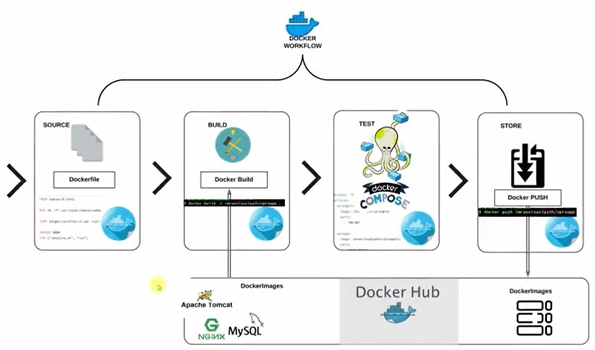

# Containerization of Java project using Docker

In this project we gonna fetch source code from a Git repository, creating Docker workflows, writing Dockerfiles, building images, and pushing customized Docker images to Docker Hub.

Firstly, we will retrieve the source code from the Git repository and create a Docker workflow. To customize the services, namely nginx, Tomcat, and MySQL, we will need to write three Docker files. After writing the Docker files in the source code, we will use the Docker build command on the Docker engine, mentioning the base image in the Docker files. The base images, namely Tomcat, Nginx, and MySQL, will be pulled from Docker Hub, and we will customize them. Using the Docker build command, our images will be built by reading the Docker files. After our images are ready, we will use Docker Compose to mention all the containers with the images and test them. Once it passes the testing, we will push the customized Docker images to Docker Hub under our own account.



## Steps

1. Steps to setup our stack services
2. Find right Base image from dockerhub
3. Write Dockerfile to customize images
4. Write docker-compose.yml file to run multi containers.
5. Test it & Host Images on Dockerhub

## setup

1. Launch an Instance:
   * Name : Docker-project
   * Ami : Ubuntu
   * Instance type : t2.micro
   * Key pair : ci-vprofile-key
   * Security Group : vprofile-docker-sg
2. Login to the instance 

### Install Docker in the instance

1. to install docker follow the below steps or you can go to the docker official website and install

   ```console
   $ sudo apt update
   $ sudo apt install docker.io -y
   $ docker --version
   $ sudo systemctl status docker
   $ sudo systemctl start docker
   $ sudo usermod -aG docker ubuntu    # now logout from instance and login again
   $ docker run hello-world
   $ docker images
   ``` 

### Docker Hub

1. if you don't have docker hub account create it <https://hub.docker.com/>
2. we need three images so click on create repository:
   * Name : vprofiledb
     * public -> create
     * this is for mysql
   * Name : vprofileweb
     * public -> create
     * this is for nginx
   * Name : vprofileapp 
     * public -> create
     * this is for Tomcat image
  
### Repository

1. you can go to this repository <https://github.com/devopshydclub/vprofile-project.git> and checkout to branch docker .
2. Goto docker files -> you can check the files there

### build Images

1. Login to the instance
2. lets clone the project repo

   ```console
   $ git clone https://github.com/devopshydclub/vprofile-project.git
   $ git checkout docker
   $ cd vprofile-project
   $ ls
   $ cd Docker-files
   $ ls            # we can see our docker files here
   $ ls -R         # to check in every directory
   ```

3. lets install maven
 
   ```console
   $ cd vprofile-project
   $ sudo apt install openjdk-8-jdk -y && sudo apt install maven -y
   ```

   > in repository if you go through src -> main -> resources -> application.properties file. so make changes to the Docker file based on that. The conatiners name should be same as names mentioned in application.properties files also the ports.

4. lets build the artifact

   ```console
   $ cd vprofile-project
   $ mvn install
   $ ls
   $ ls target/   # you can see the war file
   ```

5. lets build the three images:
   
   ```console
   $ cd vprofile-project
   $ ls Docker-files/app/
   $ cp -r target Docker-files/app/
   $ ls Docker-files/app/
   $ cd Docker-files/app
   $ docker build -t ravteja/vprofileapp:V1 .        # give your docker hub repo path
   $ docker images                                   # to verify
   $ cd ../
   $ cd db/
   $ docker build -t ravteja/vprofiledb:V1 .
   $ docker images
   $ cd ..
   $ cd web/
   $ ls
   $ docker build -t ravteja/vprofileweb:V1 .        # now we have three images
   ```

6. we need more two images they don't need to be modified

   ```console
   $ docker pull memcached
   $ docker pull rabbitmq
   $ docker images
   ```

### docker compose

we use docker compose to run all the containers

1. run these commands to install docker compose

  ```console
  $ sudo curl -L "https://github.com/docker/compose/releases/download/1.29.2/docker-compose-$(uname -s)-$(uname -m)" -o /usr/local/bin/docker-compose     # This command downloads the Docker Compose binary into the /usr/local/bin directory.
  $ sudo chmod +x /usr/local/bin/docker-compose   # This command makes the Docker Compose binary executable.
  $ docker-compose --version
  ```

2.in previous repo goto compose folder you can find the docker-compose.yml. edit it according to your docker hub repository details.
  
  > in repository if you go through src -> main -> resources -> application.properties file. so make changes to the Docker file based on that. The containers name should be same as names mentioned in application.properties files also the ports.

3. lets compose

   ```console
   $ cd vprofile-project/compose/
   $ ls
   $ docker-compose up
   ```

### to access the application

1. copy the public ip and paste in the browser public-ip:80
2. username and password are admin_vp

### push the images

1. enter `ctrl c` to stop the containers
2. lets run the containers in the background

   ```console
   $ docker-compose up -d
   $ docker logs container_name    # to see its logs
   ```

3. lets push the images , first login to the dockerhub

   ```console
   $ docker login
   $ docker images
   $ docker push ravteja/vprofileapp:V1    # mention image name
   $ docker push ravteja/vprofileweb:V1 
   $ docker push ravteja/vprofiledb:V1 
   ```

4. goto dockerhub and verify the images 
