# Capstone -1
In this lab, you will create the VPC inside your AWS account. As you know, before you create VPC, you need to select a region by considering factors like cost, compliance, latency, etcetera. You will also need two subnets inside your VPC. A public subnet to host your web application. For that, you will launch an EC2 Instance. Also, a Private subnet to deploy your RDS MySQL database. Then, you will set up the connection between RDS and EC2, then install the WordPress website on the instance. Finally, you will start hosting a simple WordPress website on an EC2 instance and -> export the static assets into the S3 bucket.

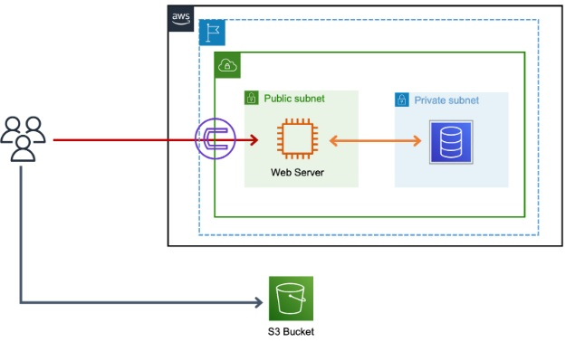

# Steps

1. Create IAM User with console And Programatic Access.
2. Creating VPC with private and public Subnets. 
3. creating Private RDS
4. Creating EC2 and Installing Wordpress
5. Linking Database with EC2
6. Accessing the WordPress
7. export the static assets into the S3 bucket.

# Setup

## Create IAM User with console And Programatic Access.

1. Go to IAM Service In AWS Console
2. Click on Users -> Create User
3. Give the User name - WordpressUser, Enable Programmatic access and Aws Management Console Access.
   > If You are using the Root Account for the Project Setup , then You can disable the Aws Management Console Access
  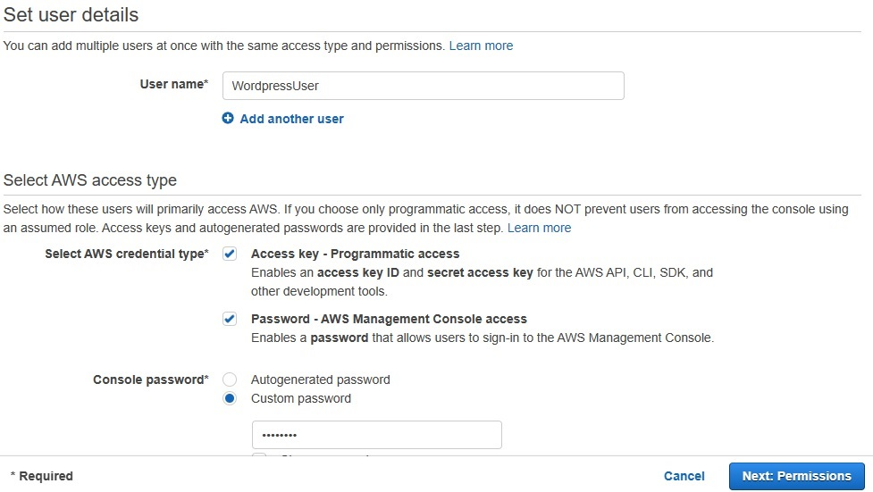
4. Next: Permissions -> click on Attach Existing Policies and select **AdministratorAccess** if you want to use it for project setup , else select **S3FullAccess** .
  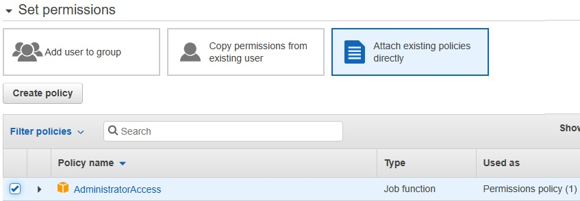 
5. Review the permissions and Create user.
6. Download the CSV file and use it when you want to access AWS cli. It contains Access key id and Secret access key id.
   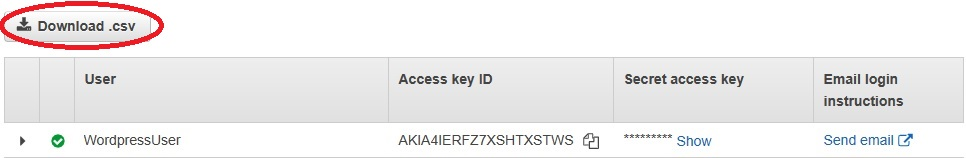
   

## To Create VPC with private and public Subnets:

1. Goto VPC -> Create VPC -> Give name and use 10.0.0.0/16 as IPv4 CIDR block 
   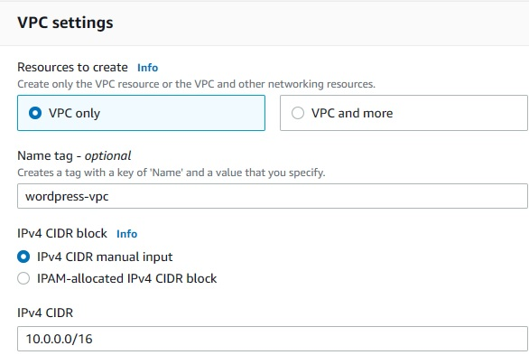

2. Create subnet -> select the vpc which  is above created
   
    * Subnet-1 -> public subnet, 10.0.0.0/24
    * Subnet-2 -> private subnet, 10.0.1.0/24
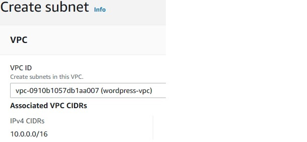
  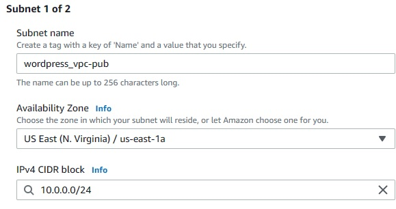
  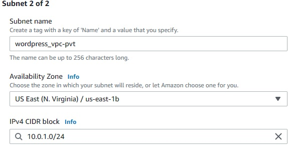
1. Create InternetGateway and Attach it to vpc we created above.
   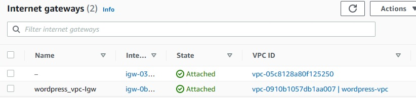
2. Create two route tables one for public and other for private. while creating select the vpc we created above.

      * select public route -> edit subnet associations -> select public subnet
      * select public route -> edit routes -> add route -> Destination - 0.0.0.0/0 , target - Internetgateway we created earlier
      * select private route -> edit subnet associations -> select private subnet
   
    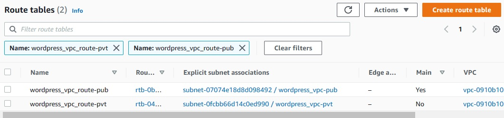

## To creat Private RDS

1. Goto RDS -> create Database
   
    * database creation method - Standard create
    * Engine type - MySQL
    * Templates - Free tier
    * DB instance identifier - database
    * Master username - admin
    * Master password - admin123
    * Disable Storage autoscaling.
    * Virtual private cloud (VPC) - Wordpress-vpc
    * Public access - **No**
    * Additional Configuration -> Database options -> Intial databse name - **wordpressdb**
    
2. After Creating Database , Select database -> click on vpc Security Group -> edit inbound rules. 
    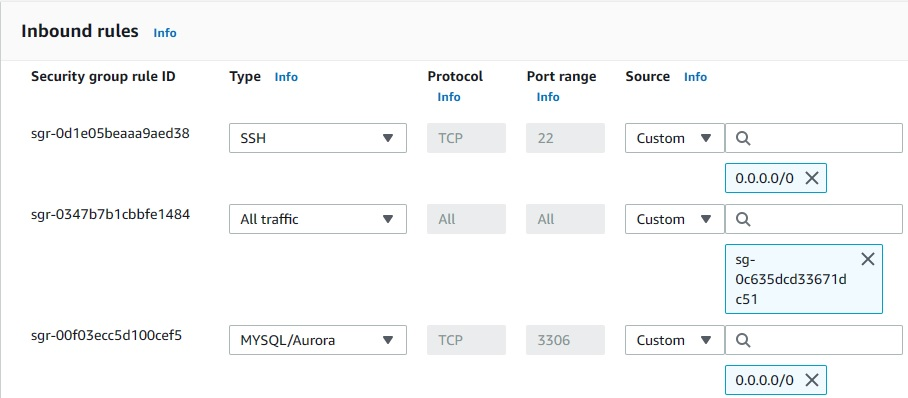

## To Creat EC2 and Installing Wordpress

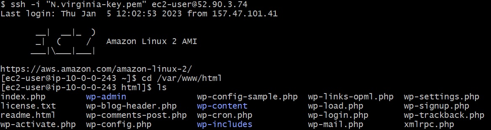

## To Access the WordPress

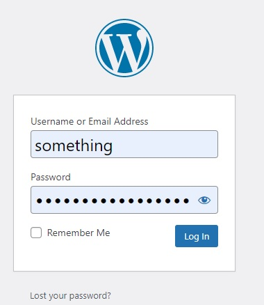

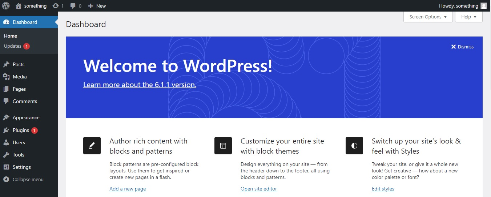

## To export the static assets into the S3 bucket.

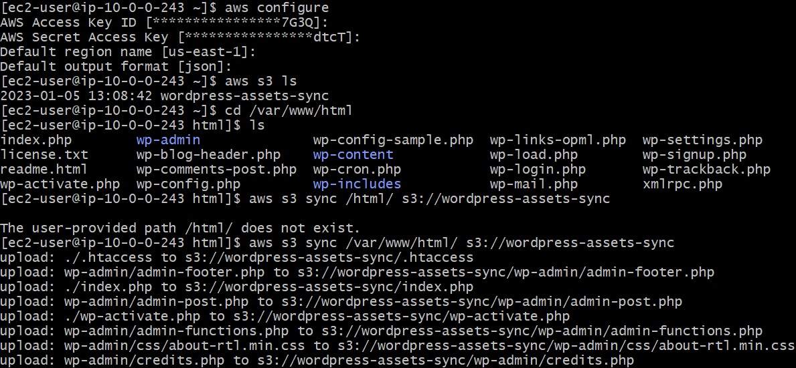

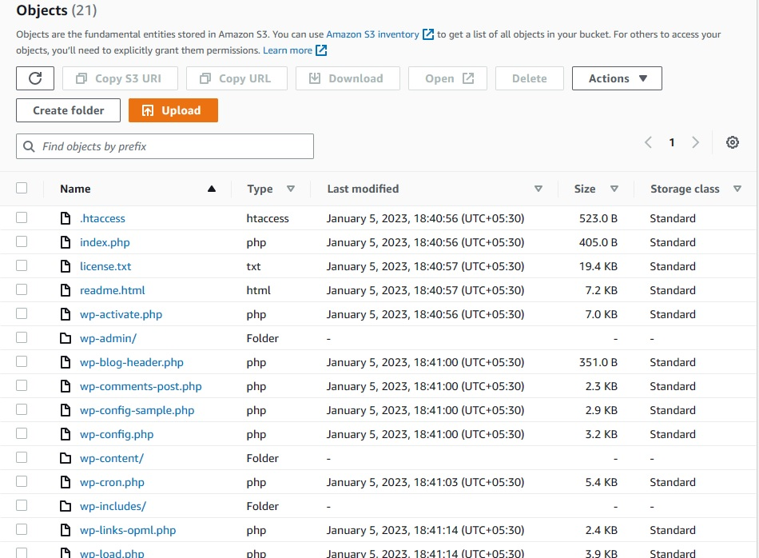