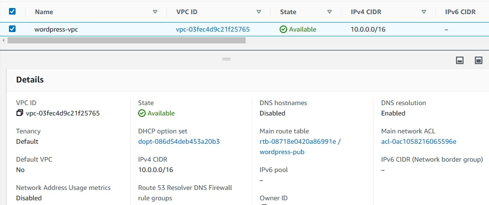

# Capstone -1
In this lab, you will create the VPC inside your AWS account. As you know, before you create VPC, you need to select a region by considering factors like cost, compliance, latency, etcetera. You will also need two subnets inside your VPC. A public subnet to host your web application. For that, you will launch an EC2 Instance. Also, a Private subnet to deploy your RDS MySQL database. Then, you will set up the connection between RDS and EC2, then install the WordPress website on the instance. Finally, you will start hosting a simple WordPress website on an EC2 instance and -> export the static assets into the S3 bucket.

# Steps

1. Creating VPC with private and public Subnets. 
2. creating Private RDS
3. Creating EC2 and Installing Wordpress
4. Linking Database with EC2
5. Accessing the WordPress
6. export the static assets into the S3 bucket.

# Setup

## To Create VPC with private and public Subnets:

## To creat Private RDS

## To Creat EC2 and Installing Wordpress

## To Access the WordPress

## To export the static assets into the S3 bucket.

