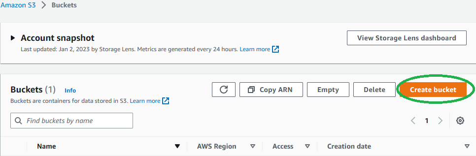
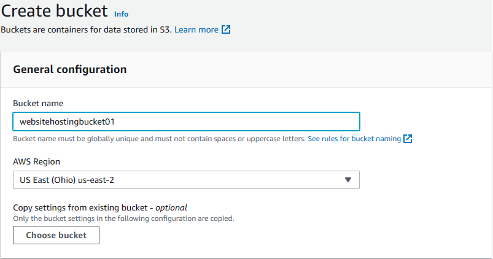
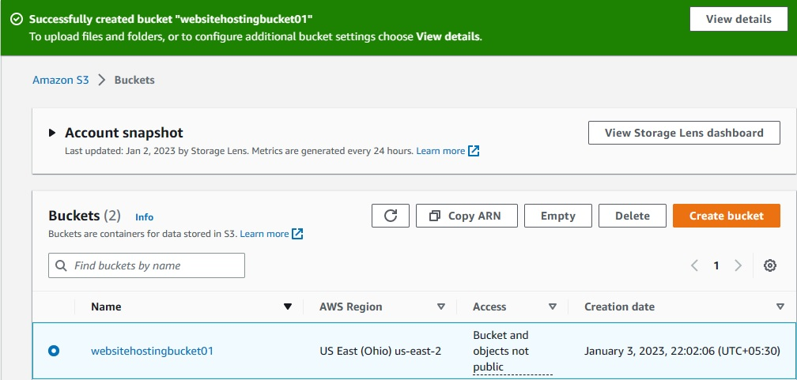
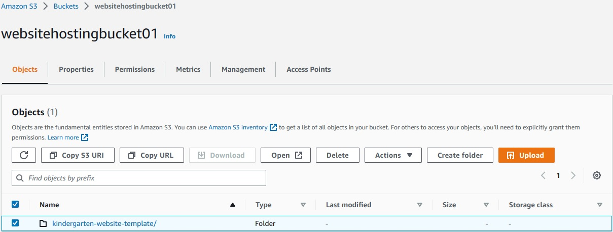
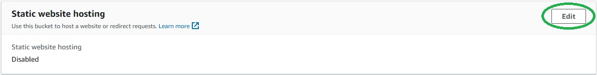
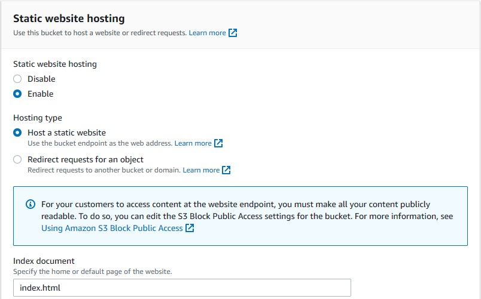

# S3 Static Webiste hosting

You can use Amazon S3 to host a static website. On a static website, individual webpages include static content. They might also contain client-side scripts.

# steps

1. Create a bucket
2. Uploaded a website folder
3. Enabling static website host in properties section
4. Entering 'index.html' in index document.
5. Paste aws s3 public bucket policy.
6. Copy the url and paste it in the browser.
   
# setup

## Create S3 Bucket

**To create S3 Bucket**
1. Open the S3 Bucket in AWS Management Console
2. Click on Create Bucket
   
3. Enter the Bucket name that should be unique globally.
   
   
4. Bucket Created Successfully
   

**To Uploaded a website folder**

1. Click Upload in the Bucket.
2. Select Add Folder and upload the website folder from your Desktop. Wait for some time to successfully complete the upload.

**To Enable static website host in properties section**

1. In properties scrool down and click on edit static website hosting.
   
2. Enable the static website hosting and mention index.html as the default page of the website in index document. Save the changes.
   